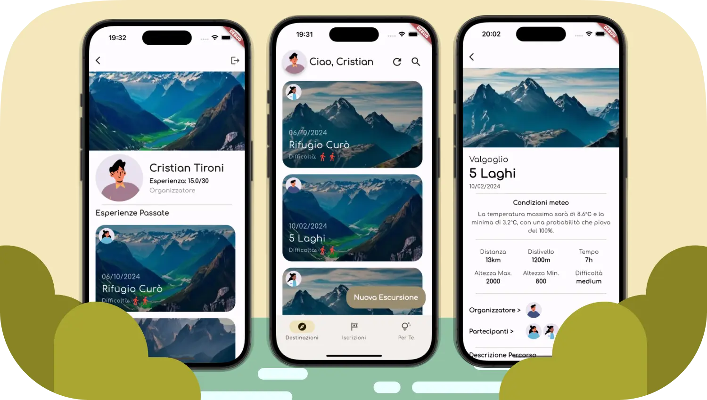

<div align="center">
  
  <h1> Progetto di PAC aa.2023-24: Mountain App </h1>

  [](https://github.com/FI-153/Progetto-PAC-2023-24/actions/workflows/Build_Push_Managers_Dep.yml)
  [](https://github.com/FI-153/Progetto-PAC-2023-24/actions/workflows/Build_Push_Managers_Dev.yml)
  [](https://github.com/FI-153/Progetto-PAC-2023-24/actions/workflows/Build_Push_Gateway_Dep.yml)
  [](https://github.com/FI-153/Progetto-PAC-2023-24/actions/workflows/Build_Push_Gateway_Dev.yml)
  [](https://github.com/FI-153/Progetto-PAC-2023-24/actions/workflows/Build_Push_Frontend_Dep.yml)
  [](https://github.com/FI-153/Progetto-PAC-2023-24/actions/workflows/Build_Push_Frontend_Dev.yml)

  
</div>

## Membri del team

| Nome e Cognome | Matricola | Mail
| --- | --- | --- |
| Federico Imberti | 1066358 | f.imberti@studenti.unibg.it
| Cristian Tironi | 1064464 | c.tironi1@studenti.unibg.it
| Stefano Gregis | 1073328 | s.gregis4@studenti.unibg.it
| Sabrin Maatoug | 1065576 | s.maatoug@studenti.unibg.it

## Demo
Una demo del progetto è dipsonibile all'indirrizzo <a href="http://165.227.152.216:9000" target="_blank" rel="noreferrer noopener"> http://165.227.152.216:9000 </a>. Per accedere è possibile usare uno dei profili generati come mockup con ChatGPT all'iterazione 3. Maggiori dettagli sono disponibili nella guida utente dell'iterazione 4.
> [!NOTE]
> Trattandosi di un app pensata per mobile consigliamo di stringere la finestra del browser per un'esperienza migliore. 

## Quickstart
Potete eseguire il progetto con il seguente comando, attraverso curl e docker-compose. Il file "docker-compose.yml" verrà scaricato in locale e poi eseguito
```
curl -O https://raw.githubusercontent.com/FI-153/Progetto-PAC-2023-24/production/docker-compose.yml && docker compose up
```
<br>

> [!IMPORTANT]
> È necessario che il deamon di Docker sia attivo.

> [!CAUTION]
> Questa operazione sovrascriverà ogni file chiamato "docker-compose.yml" nella cartella in cui viene eseguito.

<br>

Per lanciare manualmente un aggiornamento di tutte le immagini che compongono l'architettura usate
```
docker start manual-update
```
